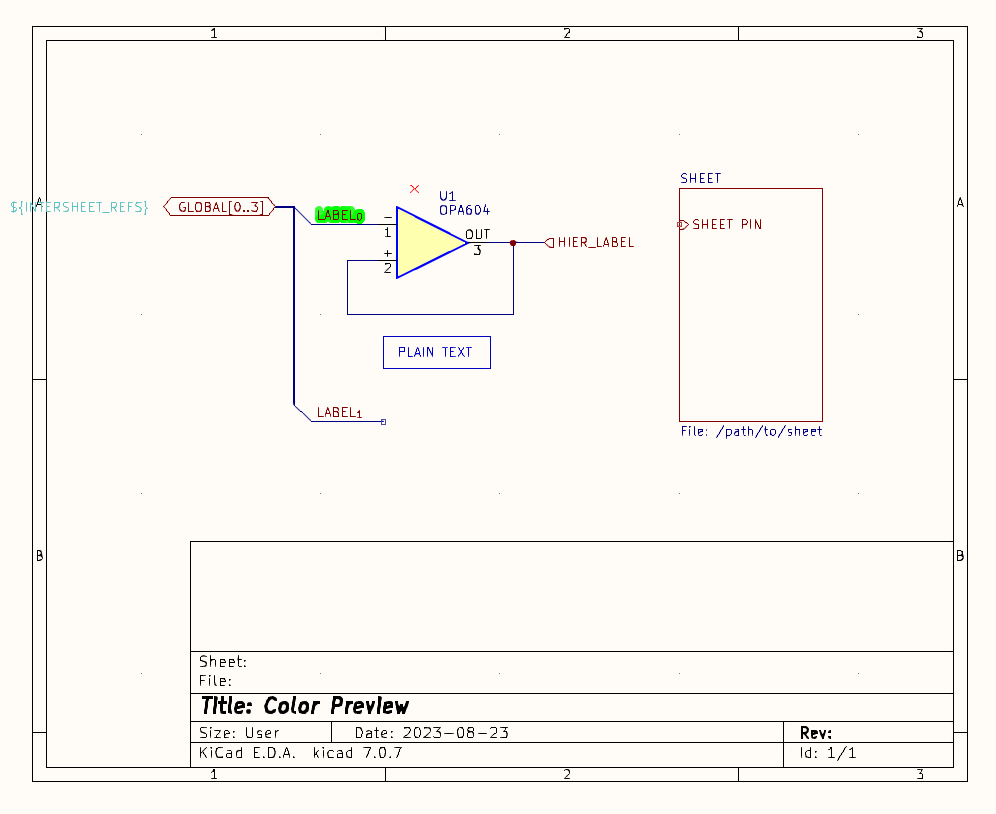

# [KiCad](https://kicad.org/) color theme inspired by popular Australians [PCB](https://www.altium.com/altium-designer) software

## Screenshots

## Instalation

### Via Mikrozone KiCad repository

Add `https://gitlab.com/andy9a9/repository/-/raw/mikrozone/repository.json` into KiCad repository via Package Manager

### Manual

Drop the file `colors/ad.json` into the following color themes directory:

Linux: `~/.config/kicad/<version>/colors`  
Windows XP: "C:\Documents and Settings\<username>\Application Data" + kicad (= %APPDATA%\kicad) + "<version>/colors"  
Windows Vista & later: "C:\Users\<username>AppData\Roaming" + kicad (= %APPDATA%\kicad) + "<version>/colors"  
OSX: `~/Library/Preferences/kicad/<version>/colors`

## Release

`zip -r KiCad-AD-Colors.zip colors resources metadata.json -x '**/.*' -x '**/__MACOSX'`
